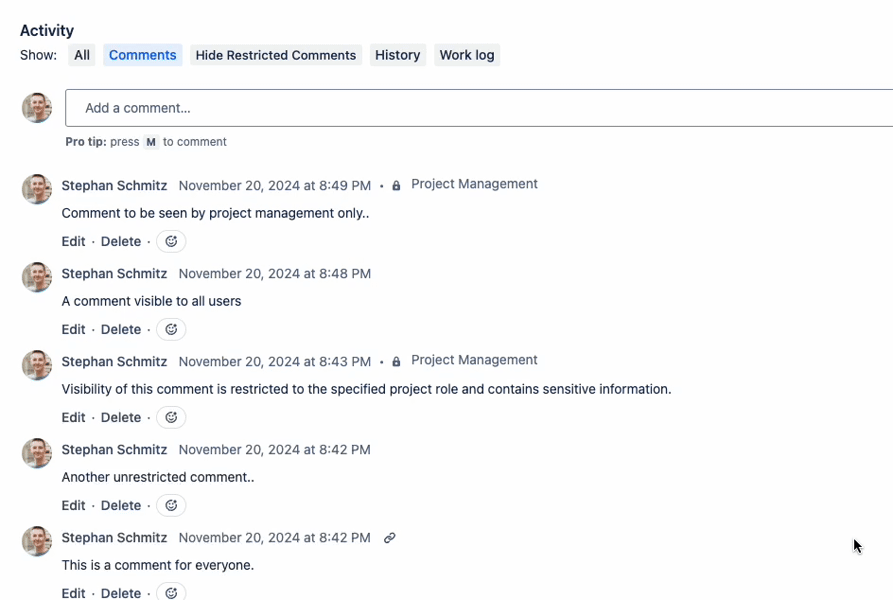

# Toggle Restricted Jira Comments

A browser extension to hide restricted Jira issue comments.

## Why?

Ever needed to share your screen with a client or co-worker, but did not wanted them to see internal / restricted comments on a Jira issue?

This browser extension adds a button to the activity feed of every issue page in the Jira cloud to let you toggle the visibility of restricted comments. 

This allows to share your screen without sharing restricted / sensitive information.

## Installation

- Chrome / Edge: In review
- Firefox: https://addons.mozilla.org/de/firefox/addon/toggle-restricted-jira-comment/

## Live demo

## License

MIT, http://eyecatchup.mit-license.org
